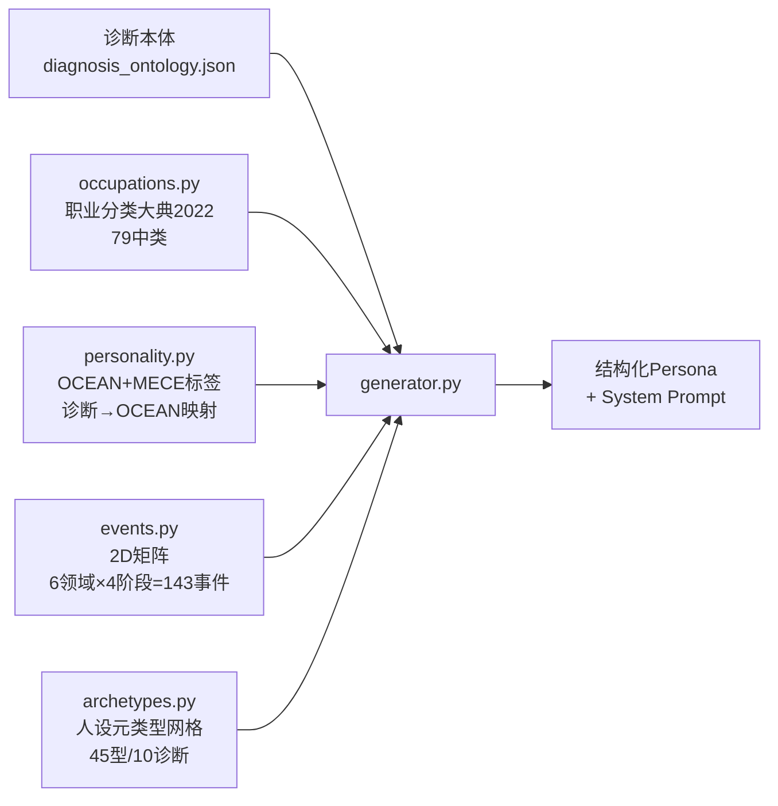

# Persona Generator

> **来源**：`AI-persona/` 独立项目  
> **用途**：生成结构化模拟人物（健康/患者）用于精神病学 AI 评估

---

## 基本原理

用五个模块分别覆盖人物的基本面，然后组装为 Structured System Prompt：



---

## ⭐ 人设元类型网格（v1.2 核心）

**问题**：v1.1 宣称的「三层空间 10²⁹ → 10⁷~10⁸」是虚假的——
`stratification.calculate_total_compression()` 自己承认分层只是**软约束**，
理论组合数仍 ≥10²⁸ 不可枚举；而决定人设内核的模板池实测极小
（价值观 11 种 / 社交 17 种 / 创伤每诊断 5 条 / 补偿欲望与内在需要各仅 1 条）。

**解法**：每个诊断定义有限个**人设型（archetype）**，型决定心理内核
（wound→desire→need 因果链），诊断只决定症状学外壳。

```
诊断 (37) → 人设型 (每诊断 4~5 个，硬网格可枚举) → 型内变体 → 表层 OCEAN/标签/事件
```

当前：**10 诊断 / 45 型 / 720 深层身份**。未覆盖的 27 个诊断自动回退旧逻辑。

```python
from core.archetypes import sample_archetype, calculate_archetype_compression
a = sample_archetype("depressive", rng)   # None = 该诊断未定义网格
calculate_archetype_compression()         # 或命令行 python core/archetypes.py
```

**⚠️ 坑**：`cross_constraints.adjust_storr_*_by_ocean()` 在极端 OCEAN 下会
**整体替换** wound/desire/need 文本、抹平人设型。`generator.py` 因此刻意不传
ocean 给这些函数。新增调整逻辑须沿用「型专属优先，OCEAN 只微调」。

效果（200 次同诊断同人口学去重率）：
values 11→39 / social 17→61 / wound 5→20 / comp_desire 1→10 / storr_need 1→10

---

---

## 快速使用

```python
from core import generate_persona, batch_generate

# 生成一个重度抑郁患者 Persona
p = generate_persona(primary_diagnosis="重度抑郁障碍", rng_seed=42)
print(p.system_prompt)

# 批量生成（含健康对照）
personas = batch_generate(20, seed_pool=[
    "重度抑郁障碍", "广泛性焦虑障碍", "精神分裂症",
    "双相I型障碍", "无精神障碍（健康）",
])
```

---

## 职业分类 — 79 中类取舍

基于《职业分类大典(2022)》，选择 **79 中类**而非 1636 细类。

**理由**：
1. Persona 不需要精确职业代码（中类粒度足矣）
2. 79 中类可读可筛选（`--occupation-filter`），1636 细类会淹没 CLI
3. 可通过 `occupation_detail` 字段自然语言补充精确岗位

**默认加权**：大类 2(专业技术 30%)、4(生活服务 25%)、6(生产制造 18%) 权重最高，类 1(党政 5%)、7(军人 2%) 最低。

**诊断-职业压力关联**：标注了每个中类的 stress_level（high/medium/low），诊断采样时自动匹配（如抑郁→倾向于高压职业）。

---

## 性格系统 — OCEAN + MECE 标签库

**理论**：McCrae & Costa 大五人格(FFM)，50+ 国家跨文化验证。

**MECE 设计**：
- 5 维 × 2 极 = 10 个特质簇
- 每个簇 5-7 个标签 = **50 个核心标签**
- 正交因子确保互斥+全覆盖

**诊断关联**：每个诊断有预置 OCEAN 范围（1-10 分），基于 Kotov et al. (2010) 等 5 项元分析。

---

## 生活事件 — 2D 矩阵

**MECE 设计**：
- 6 个领域（家庭/教育/职业/健康/经济/人际）× 4 个阶段（童年/青少年/成年/中老年）
- **143 个事件模板**，每个标注效价（44+/67-/32●）和诊断关联（trigger/maintain）
- 采样时优先抽取诊断触发事件（1-2 个）

---

## 完整 Persona 字段

| 字段 | 说明 |
|------|------|
| id/label | 唯一标识 |
| age/gender | 根据诊断发病年龄采样 |
| occupation/code | 79 中类+编码 |
| education/locale/marital | 人口学 |
| primary_diagnosis/comorbidities | 诊断+共病 |
| **archetype_key/name/one_liner** | **人设元类型（v1.2，未覆盖诊断为空串）** |
| ocean 5-dim | 1-10 分 |
| personality_tags | 精选标签 |
| cognitive/coping_styles | 认知+应对 |
| life_events | 时间线 |
| system_prompt | 组装结果 |

---

## 参数调整清单

所有参数通过 `PersonaGenerator()` 构造函数可调：

- `occupation_major_weights` — 8 类权重
- `occupation_major_filter` — 限定大类
- `occupation_stress_filter` — 限定压力水平
- `event_count` (默认 6) — 事件数
- `event_*_ratio` — 效价比
- `personality_tag_count` (默认 4)
- `healthy_ratio` (默认 0.2)
- `age_range` (默认 18-75)

---

## 路径

- 代码：`AI-persona/core/`
- 诊断本体：`AI-persona/diagnosis_ontology.json`
- 详细文档：`AI-persona/core/README.md` / `AI-persona/README.md`
