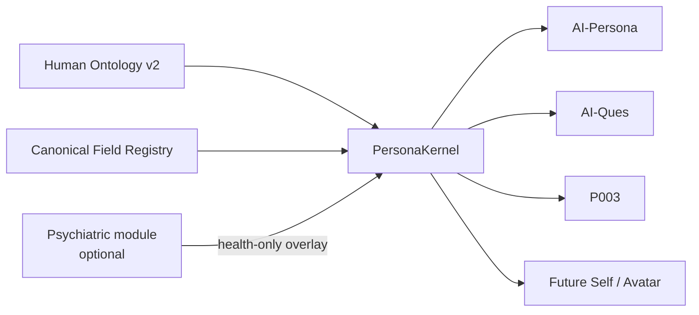

# AI-Persona Skill

> **来源**：`AI-persona/`  
> **默认用途**：生成 ontology-native `PersonaKernel`，供 AI-Persona / P003 / AI-Ques 等共享。

## 首选模式：Human Ontology v2



核心规则：
- 一个概念只有一个 canonical semantic home；
- MECE 只用于回答同一问题的同级分类；
- entity / quality-disposition / role / relation / process-event / state 分开；
- diagnosis 是可选健康信息，不是 Person 根节点；
- generated / inferred / observed / measured 必须区分；
- 诊断默认只能影响 mental-health/current-state，不得决定人格、价值、道德、能力或人生史。

## 快速使用

### v2 安全 API

```python
from core import generate_persona_kernel

kernel = generate_persona_kernel(
    primary_diagnosis="重度抑郁障碍",
    rng_seed=42,
)

print(kernel.to_dict())
```

默认 `health_only` semantic firewall：同一个 seed 换不同诊断时，非健康域的人格与人生事件保持独立。

需要明确复刻 v1.x 旧行为时：

```python
from core import KernelGenerationPolicy, KernelGenerator

kernel = KernelGenerator(
    rng_seed=42,
    policy=KernelGenerationPolicy("legacy_full"),
).generate("重度抑郁障碍")
```

### legacy API

```python
from core import generate_persona

p = generate_persona(primary_diagnosis="重度抑郁障碍", rng_seed=42)
print(p.system_prompt)
```

仅用于旧数据集、旧实验与兼容性复现。

## 精神疾病体系怎么处理

`diagnosis_ontology.json` **保留，不删除**。它被挂载在：

```
mental_neurodevelopmental_health
  ├─ symptoms / experiences
  ├─ functional impact
  ├─ diagnoses (optional)
  ├─ treatment / support
  ├─ course / recovery
  └─ risk / protective factors
```

旧版按诊断采样 OCEAN、archetype、事件等机制仍保留在 legacy generator，但不能继续被当作 canonical ontology 逻辑。

## Archetype

`core/archetypes.py` 的 45 个既有人设型是 **narrative_identity 生成资产**：
- 可以继续复用其 wound / desire / need / arc 内容；
- 不是临床人格类型；
- 不是心理测量真值；
- diagnosis-keyed 采样属于 legacy compatibility；
- native v2 应优先做 diagnosis-neutral narrative sampling。

## Big Five / OCEAN

OCEAN 属于：

`personality_psychology.temperament_traits`

它是一个特质模型，不是 Human Ontology 的严格 MECE 划分，也不覆盖 motives / values / beliefs / coping / relationships / narrative identity / surface expression。

## 关键文件

- `ontology/human_ontology.v2.json`
- `ontology/CANONICAL_FIELD_REGISTRY.json`
- `ontology/V1_TO_V2_MIGRATION.json`
- `ontology/persona_kernel.schema.json`
- `ontology/CONSUMER_CONTRACT.md`
- `ontology/HUMAN_ONTOLOGY_REVIEW.md`
- `core/persona_kernel.py`
- `core/kernel_generator.py`
- `core/legacy_adapter.py`

## 修改 ontology 前

先检查 `CANONICAL_FIELD_REGISTRY.json`，再回答：
1. canonical home 是什么？
2. ontological kind 是什么？
3. 是新概念，还是现有概念的 relation/view？
4. cardinality / temporality 是什么？
5. 是否 sensitive？
6. 是否存在 deterministic inference 风险？
7. v1 字段怎么迁移？
8. P003 / AI-Ques 是否仍能读？

## 质量门

```bash
python scripts/validate_human_ontology.py
python scripts/validate_human_ontology_v2.py
python scripts/test_persona_kernel_compat.py
python scripts/test_persona_kernel_contract.py
python scripts/test_ontology_json_assets.py
python scripts/check_ontology_release_gate.py
python scripts/test_events_sampling.py
python -m py_compile core/*.py
```

全部通过后才能考虑将 v2 从 release candidate 提升为 canonical。
